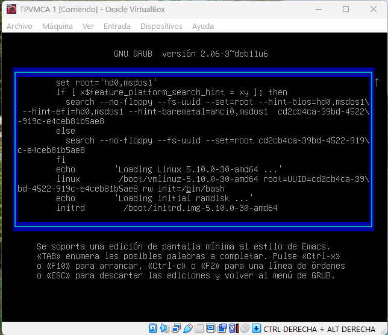
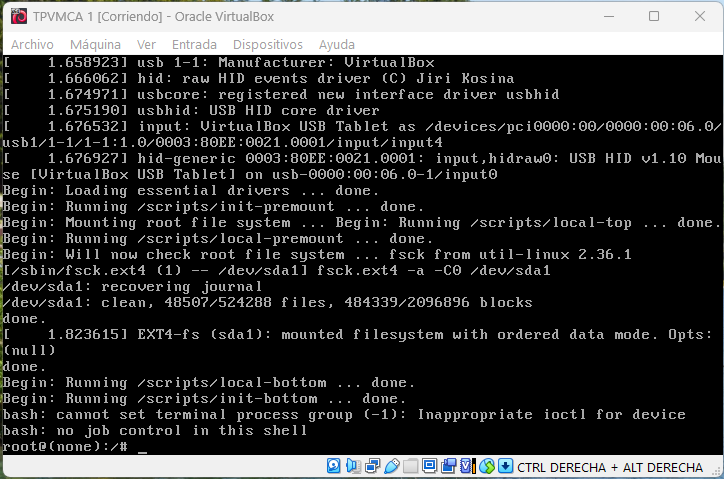
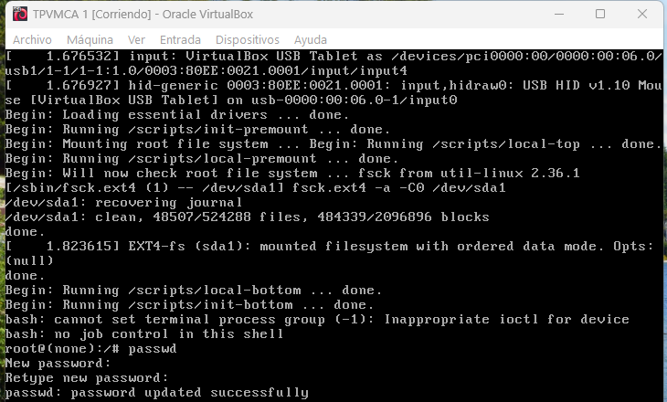
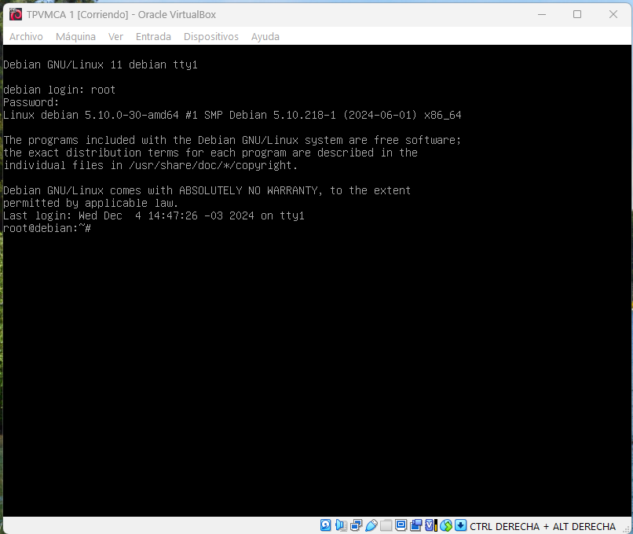
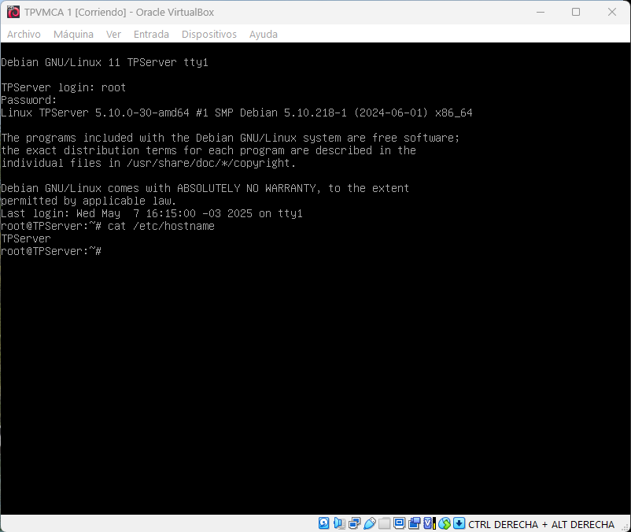
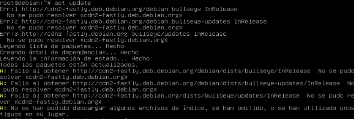
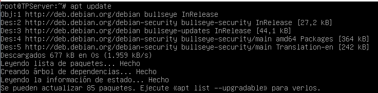
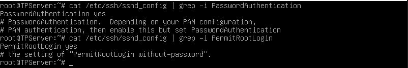
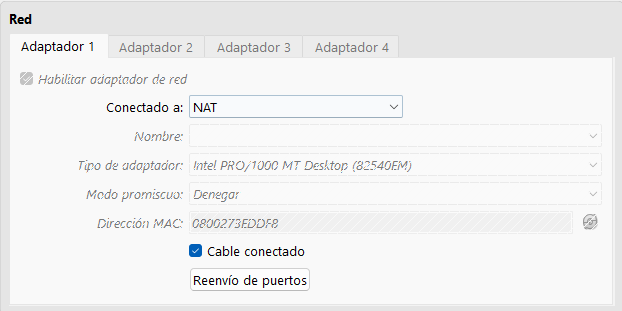
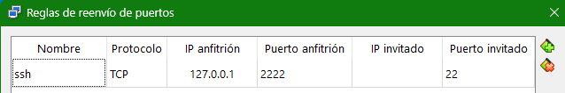

# Entrega: Configuración Completa de SSH y LAMP en Debian VM

Este documento reúne de forma ordenada y con formato final el tutorial paso a paso, incluyendo todos los comandos, explicaciones y soluciones (*troubleshooting*) necesarias para:

1. Importar una VM Debian en VirtualBox.
2. Recuperar y cambiar la contraseña `root`.
3. Configurar acceso SSH mediante clave.
4. Instalar y configurar Apache + PHP + MariaDB.
5. Establecer red estática.
6. Añadir, particionar y montar un segundo disco.
7. Automatizar montajes con `/etc/fstab`.
8. Mover el sitio web a un volumen dedicado.
9. Ajustar permisos y accesos en Apache.
10. Probar y depurar PHP.
11. Instalar extensión `mysqli`.
12. Crear los tarballs de entrega y subirlos al repositorio.
13. Próximos pasos: `/proc`, script de backup y cron.

---

## 1. Descarga y ensamblado de la VM

1. Descargar los archivos: `TPVMCA.part01.rar` … `TPVMCA.part09.rar` desde Blackboard.
2. En Windows, con WinRAR o 7-Zip:

   ```text
   C:\Descargas> Right-click TPVMCA.part01.rar → Extract Here
   ```

   Genera `TPVMCA.ova`.

> **Troubleshooting:**
>
> * Si falta un volumen, revisa que los `.rar` estén completos y sin renombrar.

---

## 2. Importar en VirtualBox

1. Abre **Oracle VirtualBox**.
2. **Archivo → Importar aplicación virtualizada...**, selecciona `TPVMCA.ova`.
3. Acepta valores por defecto.
4. Opcional: asigna ≥2 GB RAM y ≥2 CPUs.

> **Troubleshooting:**
>
> * Si sale “OVF version unknown”, actualiza VirtualBox.

---

## 3. Modo single-user y cambio de contraseña `root`

1. Iniciar VM. En GRUB, marca **Debian GNU/Linux** y pulsa `e`.
2. Añade al final de la línea `linux … ro quiet`: `init=/bin/bash`.
3. Arrancar: **Ctrl+X**.
4. En el shell raíz (`bash`):

   ```bash
   mount -o remount,rw /
   passwd root    # nueva contraseña "palermo"
   exec /sbin/init
   ```
### Otra opcion para el cambio de contraseña 
1. Iniciar VM. En GRUB, marca **Debian GNU/Linux** y pulsa `e`.
2. Reemplazar en la linea de linux `… ro quiet`: `rw init=/bin/bash`.
3. Arrancar: **Ctrl+X**.
4. En el shell raíz (`bash`):

   ```bash
   passwd root    # nueva contraseña "palermo"
   exec /sbin/init
   ```








> **Troubleshooting:**
>
> * Si el shell sigue de solo lectura, comprueba que `init=/bin/bash` esté en la línea correcta.

---

## 4. Configuración de host, red e Internet
1. Para cambiar el hostname
```bash
hostnamectl set-hostname TPServer
reboot
```
> **Troubleshooting:**
>
> * Si hay inconvenientes se pueden modificar los archivos /hostname y /hosts manualmente
> * Utilizando el comando vim modificar un archivo a la vez
> * En donde figure el nombre del viejo hostname, reemplazarlo por el nuevo
> * Para finalizar reiniciar con "reboot" y controlar nuevo hostname con "hostnamectl"

```bash
vim /etc/hostname
TPServer
---
vim /etc/hosts
127.0.1.1 TPServer
---
reboot
---
hostnamectl
```



---
```bash
ip addr show
# Si no hay IP:
dhclient enp0s3
ping -c4 8.8.8.8
ping -c4 deb.debian.org
```

> **Troubleshooting:**
>
> * En caso de problemas DNS, edita `/etc/resolv.conf`:

```bash
vim /etc/resolv.conf
```
```text
nameserver 8.8.8.8
nameserver 8.8.4.4
```

---

## 5. Repositorios APT
1. Si al hacer apt update arroja error 

2. Crear si no existe o editar `/etc/apt/sources.list`:

   ```bash
   cat << 'EOF' > /etc/apt/sources.list
   deb http://deb.debian.org/debian bullseye main contrib non-free
   deb http://deb.debian.org/debian-security bullseye-security main contrib non-free
   deb http://deb.debian.org/debian bullseye-updates main contrib non-free
   EOF
   apt update
   ```


> **Troubleshooting:**
>
> * Si no puedes escribir `<`, usa `echo "..." >` y `>>`.

---

## 6. Instalación de OpenSSH y acceso por clave

### 6.1 Instalar

```bash
apt install -y openssh-server
systemctl status ssh
```


### 6.2 Preparar clave pública
1. Crear el directorio /root/.ssh si no existe
2. Cambiarle los permisos para que solo el usuario root tenga acceso de lectura, escritura y ejecucion

```bash
mkdir -p /root/.ssh
chmod 700 /root/.ssh
```

### 6.3 Autenticación por contraseña temporal

```bash
sed -i 's/^#\?PasswordAuthentication .*/PasswordAuthentication yes/' /etc/ssh/sshd_config
sed -i 's/^#\?PermitRootLogin .*/PermitRootLogin yes/'      /etc/ssh/sshd_config
systemctl restart ssh
```


### 6.4 Port-forwarding NAT en VirtualBox

* NAT → Avanzado → Reenvío de puertos: `127.0.0.1:2222 → 22`



### 6.5 Copiar clave pública

```powershell
cd "C:\Users\Documents\...\claves"
scp -i .\clave_privada.txt -P 2222 .\clave_publica.pub root@127.0.0.1:/root/
```

en la VM:

```bash
cat /root/clave_publica.pub >> /root/.ssh/authorized_keys
chmod 600 /root/.ssh/authorized_keys
rm /root/clave_publica.pub
```

### 6.6 Deshabilitar contraseña

```bash
sed -i 's/^PasswordAuthentication .*/PasswordAuthentication no/'             /etc/ssh/sshd_config
sed -i 's/^PermitRootLogin .*/PermitRootLogin prohibit-password/'           /etc/ssh/sshd_config
systemctl restart ssh
```

### 6.7 Probar SSH

```powershell
ssh -i .\clave_privada.txt -p 2222 root@127.0.0.1
```

> **Troubleshooting:**
>
> * `scp` pide password: revisa passphrase / password root.
> * `Connection timed out`: revisa port-forward y VM encendida.

---

## 7. Apache + PHP ≥ 7.3

```bash
apt install -y apache2 php libapache2-mod-php
systemctl status apache2
```

Copia tu web:

```bash
cp /mnt/blackboard/index.php /var/www/html/
cp /mnt/blackboard/logo.png   /var/www/html/
chown www-data:www-data /var/www/html/*
chmod 644 /var/www/html/*
```

> **Troubleshooting:**
>
> * Blanco en PHP: revisa `/var/log/apache2/error.log`.

---

## 8. MariaDB

```bash
apt install -y mariadb-server mariadb-client
systemctl enable --now mariadb
systemctl status mariadb
```

Importa dump:

```bash
mariadb -u root < /root/db.sql
mariadb -u root -e "SHOW DATABASES;"
```

> **Troubleshooting:**
>
> * Socket error: arranca la unidad correcta (`mariadb.service`).

---

## 9. Red estática

Edita `/etc/network/interfaces`:

```text
auto enp0s3
iface enp0s3 inet static
  address 10.0.2.15
  netmask 255.255.255.0
  gateway 10.0.2.2
```

```bash
systemctl restart networking
ip addr show enp0s3
```

---

## 10. Segundo disco 10 GB en VirtualBox

**Host:**

1. Apaga VM.
2. Configuración → Almacenamiento → SATA → + disco → VDI 10 GB.
3. Inicia VM.

**VM:**

```bash
lsblk  # detecta /dev/sdc
fdisk /dev/sdc
# n p 1 <Enter> +3G
# n p 2 <Enter> +6G
# w
lsblk /dev/sdc
```

---

## 11. Formatear y montar particiones

```bash
mkfs.ext4 /dev/sdc1
mkfs.ext4 /dev/sdc2
mkdir -p /www_dir /backup_dir
mount /dev/sdc1 /www_dir
mount /dev/sdc2 /backup_dir
df -h | grep -E '/www_dir|/backup_dir'
```

---

## 12. Automontaje (`/etc/fstab`)

```bash
blkid /dev/sdc1 /dev/sdc2
vi /etc/fstab
# Añade:
# UUID=<tu-UUID-sdc1> /www_dir    ext4 defaults 0 2
# UUID=<tu-UUID-sdc2> /backup_dir ext4 defaults 0 2
umount /www_dir /backup_dir
mount -a
df -h | grep dir
```

---

## 13. Reubicar sitio web a `/www_dir`

```bash
systemctl stop apache2
mv /var/www/html/* /www_dir/
chown -R www-data:www-data /www_dir
find /www_dir -type d -exec chmod 755 {} \;
find /www_dir -type f -exec chmod 644 {} \;
vi /etc/apache2/sites-available/000-default.conf
  DocumentRoot /www_dir
systemctl start apache2
```

> **403 Forbidden:**
> Añade en `/etc/apache2/apache2.conf`:
>
> ```apache
> <Directory /www_dir>
>   Options Indexes FollowSymLinks
>   AllowOverride None
>   Require all granted
> </Directory>
> ```
>
> `systemctl reload apache2`

---

## 14. Verificación de la página web

Para confirmar que Apache sirve tu web correctamente desde tu navegador de Windows:

1. **Configura el reenvío de puertos HTTP** si no lo hiciste antes:

    * VirtualBox NAT → Avanzado → Reenvío de puertos → 127.0.0.1:8080 → 80
2. **Arranca la VM** y asegúrate de que Apache está activo:

   ```bash
   systemctl status apache2
   ```
3. **En Windows abre Chrome** (u otro navegador) y visita:

   ```text
   http://127.0.0.1:8080/
   ```

   — Deberías ver tu `index.php` con el `logo.png` cargado.

## 15. Depurar PHP y logs Depurar PHP y logs

1. `test.php`:

   ```bash
   cat > /www_dir/test.php << 'EOF'
   <?php phpinfo();
   EOF
   systemctl reload apache2
   ```
2. Visitar `/test.php` o `curl http://localhost/test.php`.
3. Si no carga, habilita el módulo:

   ```bash
   apache2ctl -M | grep php
   a2enmod php7.x
   systemctl restart apache2
   ```
4. Logs:

   ```bash
   tail -n20 /var/log/apache2/error.log
   ```

---

## 16. Instalar extensión `mysqli`

```bash
apt install -y php-mysql
systemctl restart apache2
```

Tu `index.php` ya debe funcionar.

---

## 17. Crear tarballs de entrega

**En la VM**:

1. Crea y entra al directorio temporal:

   ```bash
   mkdir -p /tmp/entrega && cd /tmp/entrega
   ```
2. Genera cada archivo:

   ```bash
   tar -czpf root.tar.gz       -C /       root
   tar -czpf etc.tar.gz        -C /       etc
   tar -czpf opt.tar.gz        -C /       opt
   tar -czpf proc.tar.gz       -C /       proc --ignore-failed-read
   tar -czpf www_dir.tar.gz    -C /       www_dir
   tar -czpf backup_dir.tar.gz -C /       backup_dir
   ```
3. Verifica:

   ```bash
   ls -lh /tmp/entrega
   ```

> **Troubleshooting:**
>
> * Si `/tmp/entrega` está vacío, asegúrate de haber ejecutado `cd /tmp/entrega` antes de los `tar`.
> * Para archivar solo la subcarpeta fija de `/proc`, usa:
    >
```bash
tar -czpf proc_particion.tar.gz -C / proc/particion
```

---

## 18. Descargar tarballs a Windows y subir a GitHub

**En Windows PowerShell** (carpeta del repo):

1. Copia todos los `.tar.gz`:

   ```powershell
   scp -i .\clave_privada.txt -P 2222 root@127.0.0.1:/tmp/entrega\*.tar.gz .\
   ```
2. Verifica:

   ```powershell
   dir *.tar.gz
   ```
3. Añade a Git y sube:

   ```powershell
   git add *.tar.gz
   git commit -m "Primera entrega: tarballs de /root,/etc,/opt,/proc,/www_dir,/backup_dir"
   git push
   ```

> **Troubleshooting:**
>
> * Remote readdir error: confirma que `/tmp/entrega` existe y contiene `.tar.gz`.
> * Si falla con wildcard, prueba uno por uno:
    >
    >   ```powershell
>   scp -i .\clave_privada.txt -P 2222 root@127.0.0.1:/tmp/entrega/root.tar.gz .\
>   ```

---

## 19. Próximos pasos / Pendientes

* Crear enlace `/proc/partitions → /proc/particion` en `/etc/fstab`.
* Escritura de `/opt/scripts/backup_full.sh`.
* Configuración de cron para backups.

*Fin del tutorial y entregable.*
